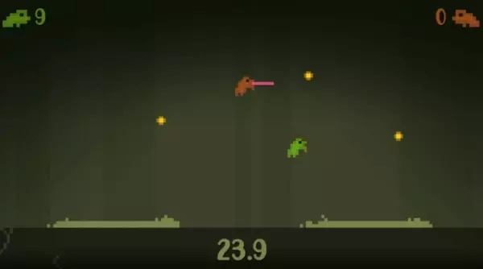

# Toads and Fireflies

A 2D arcade style game in which two toads need to jump and try to catch fireflies.

Controls:

- `Space` controls the green frog
- `Return` controls the right frog.

While on ground, hit `Space` or `Return` once to jump. While in air, hit `Space` or `Return` to use the tongue.

Here's a video of the game in action:

## Licenses and Attributions

The sprites and backgrounds used in this game are taken from the Zenva Course material.

This game is using the [Go Frog](https://fontsme.com/go-frog.font) font, which is free to use for personal use. 

Sound effects were downloaded from [freesound](https://freesound.org/):

### [CC0 1.0](https://creativecommons.org/publicdomain/zero/1.0/)

- [Forest at night, crickets, cicadas and insects in the Sian Ka'an Biosphere Reserve](https://freesound.org/people/felix.blume/sounds/328293/) by [felix.blume](https://freesound.org/people/felix.blume/)
- [tongue click](https://freesound.org/people/Chriddof/sounds/135515/) by [Chriddof](https://freesound.org/people/Chriddof/)
- [Steel Tongue Drum played by Cicada near Lake Michigan](https://freesound.org/people/elliotrambach/sounds/381955/) by [elliotrambach](https://freesound.org/people/elliotrambach/)

### [CC BY 3.0](https://creativecommons.org/licenses/by/3.0/)

- [Sigh out tongue](https://freesound.org/people/Hawkeye_Sprout/sounds/469154/) by [Hawkeye_Sprout](https://freesound.org/people/Hawkeye_Sprout/)
- [Tongue out (raspberry)](https://freesound.org/people/majd_abdulqadir/sounds/345382/) by [majd_abdulqadir](https://freesound.org/people/majd_abdulqadir/)
